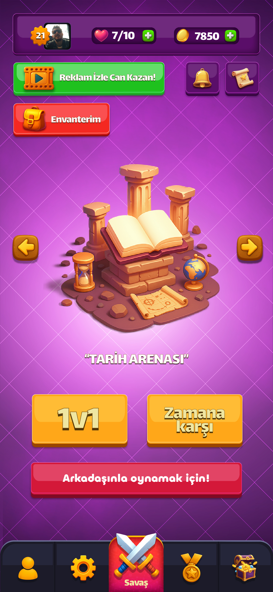
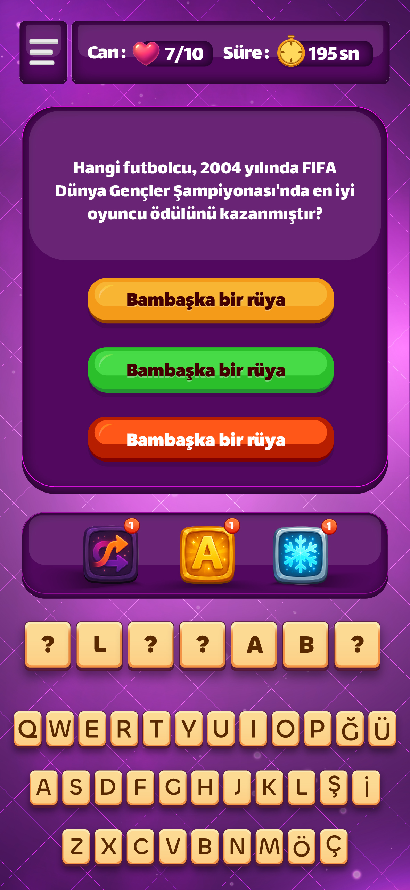
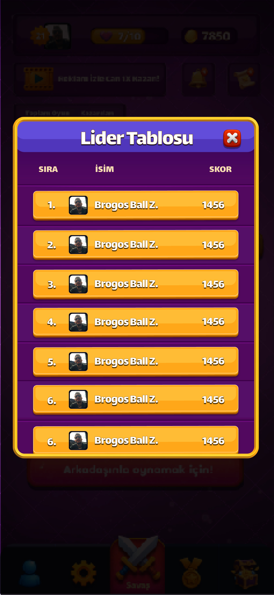
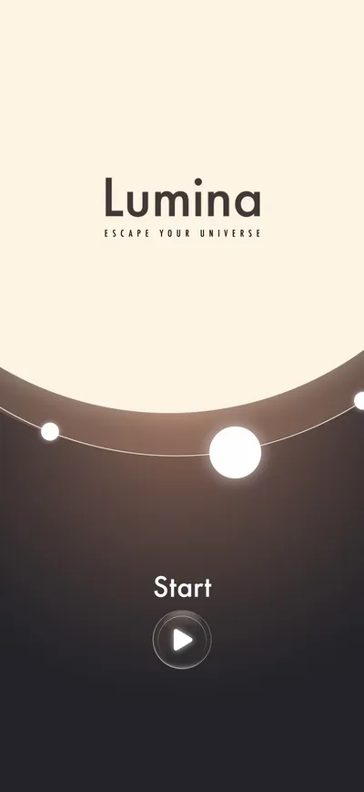
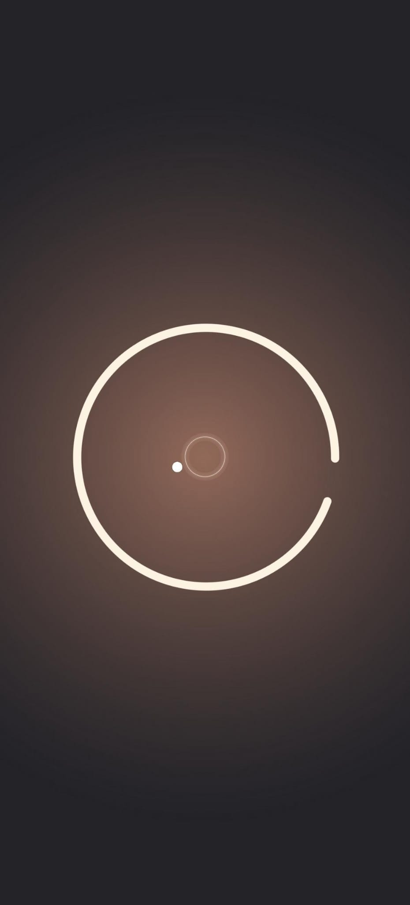
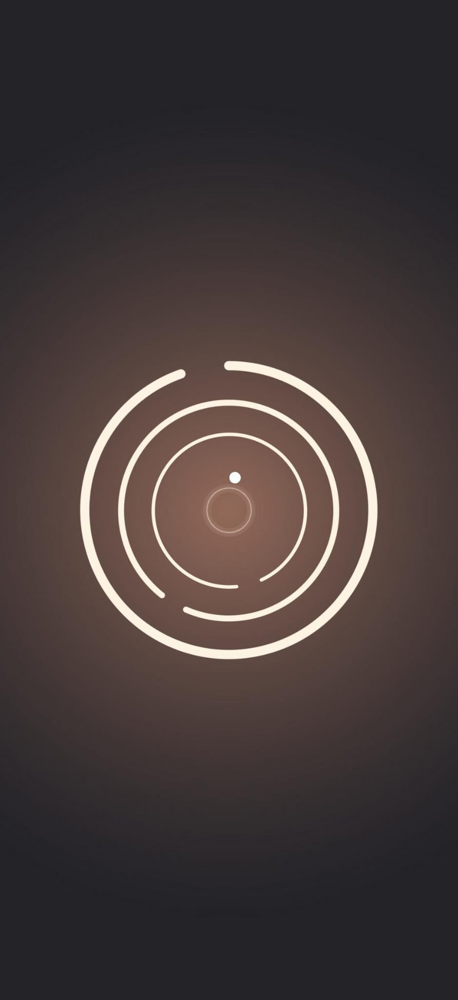

<h1 align="center">Hey, I'm Ahmet 👾</h1>
<h3 align="center">Mobile Game Developer | Unity & C# </h3>

  
  
  

---

## 🎮 Featured Projects

### 📱 Bildin Bildin – Mobile Trivia Game
Multiplayer trivia game with Firebase, Photon PUN, Google AdMob, and Google Sign-In.  
Includes real-time matchmaking, in-game economy, and leaderboards.

  
  
  

🔗 [View Repo](https://github.com/ahmetzerin/bildin-bildin)

---

### ✨ Lumina – Arcade-Style 2D Game
Fast-paced arcade game featuring rotation mechanics, shooting, timers, and smooth gameplay.  
Implemented Audio Manager, Haptic Feedback, and Object Pooling for performance.

  
  
  

🔗 [View Repo](https://github.com/ahmetzerin/lumina)

---

## 🛠️ Tech Stack

  
  
  
  
  

---

## 📊 GitHub Stats

  
  

---

## 🌐 Connect with Me

  
  
  

